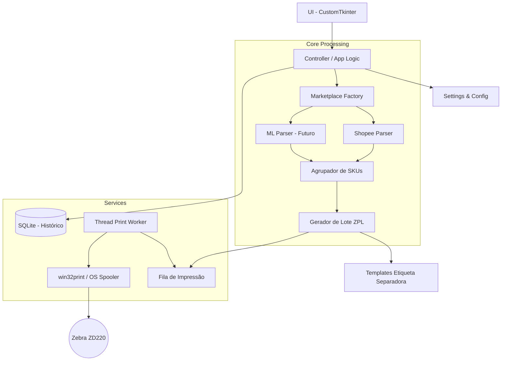
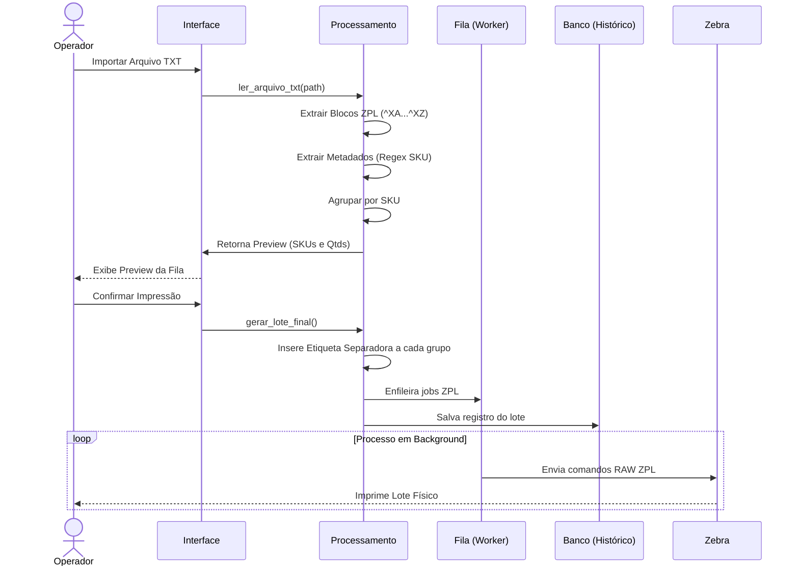
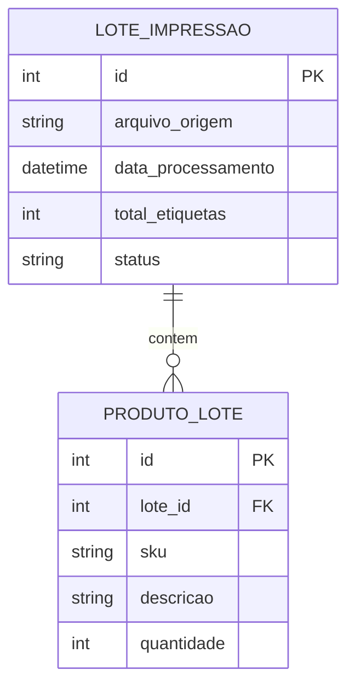

# Especificação Técnica e Arquitetura: Automação Logística ZPL (Shopee Full)

Como Arquiteto de Software, realizei a análise da sua demanda para o processamento e impressão inteligente de etiquetas ZPL da Shopee. Abaixo, detalho o projeto ponta a ponta para que possa ser implementado de forma escalável e segura.

## 1. Viabilidade Técnica
A proposta é **altamente viável**. O padrão ZPL II da Zebra é estruturado e trabalha com texto puro.
* **Leitura e Separação:** A detecção dos delimitadores `^XA` (início) e `^XZ` (fim) torna a extração dos blocos de etiquetas trivial e segura.
* **Extração de Metadados (SKU/Descrição):** Será o ponto de maior atenção. O ZPL define o texto a ser impresso geralmente dentro de comandos de campo de dados (`^FD`). Precisaremos mapear com Regex as coordenadas (`^FO`) ou as fontes (`^A0N`) que a Shopee utiliza para o SKU e Descrição, para extrair essa informação de forma consistente.
* **Comunicação com a Impressora:** O Python, através da biblioteca `win32print` (pywin32), consegue se comunicar com o Spooler do Windows e enviar dados RAW (RAW DataType) diretamente para o driver da Zebra ZD220.

## 2. Melhorias de Arquitetura Sugeridas
Para garantir que a aplicação não apenas resolva o problema hoje, mas seja sustentável:

1. **Processamento Assíncrono (Worker/Queue):** O envio de ZPL para a impressora e o processamento de arquivos grandes não devem travar a interface gráfica. Devemos usar `threading` com `queue.Queue` (Print Worker).
2. **Separação UI/Core (Arquitetura em Camadas):** A interface (`customtkinter`) deve apenas acionar as funções do `Core`. O parser e o gerador de lote não devem depender de nenhuma biblioteca visual.
3. **Template Engine para ZPL:** Em vez de hardcodar a etiqueta separadora, usar um arquivo de template ou uma f-string parametrizável externa (`template_separador.zpl`), facilitando alterações no design da separadora sem precisar alterar o código Python.
4. **Configurações Externalizadas:** O nome da impressora, diretórios padrão e configurações de margem devem ficar em um arquivo `config.yaml` ou `.env`.
5. **Design Pattern Strategy (Multi-Marketplace):** Para não engessar o projeto na Shopee e já prever o Mercado Livre (Full), o `Core` deve utilizar uma interface/classe base abstrata `MarketplaceParser`. Teremos implementações específicas como `ShopeeParser` e `MercadoLivreParser`, e a interface gráfica apenas dirá ao sistema qual usar.

## 3. Estrutura de Pastas Completa

```text
shopee_zpl_spooler/
├── src/
│   ├── main.py                 # Ponto de entrada da aplicação
│   ├── config/
│   │   ├── settings.py         # Validação e carregamento de configs
│   │   └── config.yaml         # Nome impressora, paths, etc.
│   ├── core/
│   │   ├── parser.py           # Lida com o TXT, extrai `^XA` -> `^XZ` e metadados
│   │   ├── agrupador.py        # Agrupa os objetos de etiqueta por SKU
│   │   ├── gerador.py          # Junta as etiquetas do SKU + Etiquetas separadoras
│   │   └── templates/          # Arquivos de template .zpl
│   ├── services/
│   │   ├── printer.py          # Integração com win32print
│   │   └── spooler_worker.py   # Thread que consome fila de impressão
│   ├── database/               # (Para a Fase 2)
│   │   ├── connection.py       # Configuração do SQLite
│   │   └── models.py           # Modelos de Lote, Produto, Histórico
│   ├── ui/
│   │   ├── app.py              # Classe principal do CustomTkinter
│   │   └── views/              # Telas (Main, Preview, Config, Histórico)
│   └── utils/
│       ├── logger.py           # Configuração de rotação de logs
│       └── zpl_utils.py        # Funções auxiliares de string/regex
├── tests/
│   └── test_parser.py          # Testes essenciais para a extração (Regex)
├── logs/                       # Diretório de saída dos logs
├── data/                       # Diretório para o SQLite e arquivos temp
├── requirements.txt
└── README.md
```

## 4. Interface Gráfica e Escolha Tecnológica

Como o objetivo é disponibilizar o projeto no **GitHub de forma open-source**, a escolha da tecnologia da UI é crucial. Recomendo **duas abordagens viáveis**:

1.  **Desktop Moderno (Python + CustomTkinter ou PySide6):**
    *   **Prós:** Mais fácil para um iniciante em Python clonar e rodar. Acesso nativo direto às impressoras USB via `win32print` sem configurações complexas de rede.
    *   **Contras:** Design pode parecer mais "rígido" comparado a interfaces web modernas.
2.  **Híbrido Local Web (Python FastAPI + Vue.js/React):**
    *   **Prós:** A interface roda no navegador (http://localhost:8000), permitindo designs lindíssimos, dashboards interativos (com gráficos Chart.js) e maior apelo visual no GitHub. O backend em Python resolve a comunicação com a impressora.
    *   **Contras:** Exige conhecimento em Frontend para manutenção.

*Sugestão de Arquiteto:* Como MVP, vá de **CustomTkinter** com um tema moderno (Dark mode). É rápido, 100% Python e atende ao requisito desktop perfeitamente.

## 5. Ideias de Funcionalidades Agregadoras

Para tornar o repositório um destaque no GitHub:
*   **Renderizador Visual de ZPL (Preview):** Antes de imprimir, chamar uma API (ex: Labelary) ou usar uma lib local para transformar o código ZPL em uma imagem PNG e mostrar na tela como a etiqueta ficará.
*   **Gestor de Templates (Modelos de Etiqueta):** Permitir que o usuário cadastre as dimensões de sua etiqueta (ex: 10x15cm, 4x3cm) e o sistema ajuste o ZPL da "Etiqueta Separadora" automaticamente para aquele tamanho.
*   **Dashboard de Produtividade:** Um gráfico na tela inicial mostrando os SKUs mais expedidos na semana e a economia de tempo gerada.
*   **Simulador de Impressora (Modo Dev):** Permitir rodar o sistema salvando arquivos TXT em vez de mandar para a impressora real (excelente para desenvolvedores testando o projeto).

## 6. Definição do Roadmap (MVP, V1 e V2)

### 🔴 MVP (Fase 1 - Foco: Resolver a dor imediata)
* **Interface Gráfica Base (CustomTkinter):**
    * Combobox para selecionar a **Impressora** (listando as locais do Windows).
    * Dropdown para **Modelo de Etiqueta** (Tamanho 10x15, etc).
    * Botão/Área Drag & Drop para **Anexar o arquivo TXT**.
    * Painel lateral de **Log de impressão** (sucesso/erro).
* **Core:** Leitura do TXT, Regex para separar `^XA...^XZ`, Regex básica para SKU.
* **Agrupamento:** Ordenar por SKU em memória.
* **Geração:** Inserir 1 etiqueta separadora padrão fixada no código.
* **Impressão:** Envio síncrono ou assíncrono básico via `win32print` para impressora padrão.
* **Log:** Apenas log em arquivo de texto.

### 🟡 Versão 1 (Fase 2 - Foco: Resiliência e Controle)
* **Interface Aprimorada:** Tabela listando os SKUs encontrados no TXT e a quantidade de cada um *antes* de imprimir (Preview da fila).
* **Banco de Dados (SQLite):** Registro de cada "Lote" processado (Data, Arquivo Origem, Qtd Etiquetas).
* **Reimpressão:** Botão para reimprimir um lote do histórico.
* **Arquitetura Pluggable (Múltiplos Marketplaces):** Refatorar o parser para isolar as lógicas. Preparar a base abstrata para o Parser do Mercado Livre.
* **Worker:** Impressão em thread separada com barra de progresso real na UI.

### 🟢 Versão 2 (Fase 3 - Foco: Automação e Escalabilidade)
* **Suporte Integral ao Mercado Livre (Full).**
* **Monitoramento Automático:** Serviço `watchdog` na pasta de Downloads.
* **Integração API Shopee/ML:** Download automático das etiquetas pendentes.
* **Dashboard de Produtividade:** Gráficos visuais de operação.

## 7. Riscos Técnicos e Mitigações

| Risco | Probabilidade | Impacto | Mitigação |
| :--- | :---: | :---: | :--- |
| **Mudança no layout ZPL da Shopee** | Média | Alto | Não basear a extração do SKU apenas na posição da linha, mas usar padrões (Regex) buscando chaves próximas como "SKU:", ou código de barras. Isolar a lógica de parse no `parser.py` para fácil manutenção. |
| **Impressora engasgar com buffer lotado** | Baixa | Alto | A Zebra ZD220 tem memória limite. Enviar lotes gigantes (milhares de etiquetas) de uma vez pode travar. O `spooler_worker` deve mandar as etiquetas fragmentadas (ex: blocos de 50). |
| **Permissões do Windows (win32print)** | Baixa | Médio | Empacotar com orientações de execução, e usar tratamento de exceção (`try/except`) claro ao tentar acessar o spooler do Windows, exibindo alerta amigável ao usuário. |
| **Problema de Encoding (UTF-8)** | Alta | Baixo | Arquivos TXT da Shopee e ZPL possuem particularidades com acentos (ex: `^CI28`). Garantir que toda leitura de arquivo e envio para impressora tenha o encoding correto (`utf-8` ou `cp1252`). |

---

## 8. Diagramas

### Diagrama de Componentes (Arquitetura)



### Diagrama de Fluxo (Processamento do Lote)



---

## 9. Modelo de Dados (SQLite - Fase 2)

O banco de dados local armazenará os lotes para fim de histórico e reimpressão.



## 10. Especificação Técnica dos Módulos para o Claude

Aqui estão os detalhes das classes principais a serem pedidas na geração de código:

### `parser_shopee.py`
* **Classe:** `ShopeeZPLParser`
* **Método Principal:** `parse_file(filepath: str) -> list[dict]`
* **Lógica Interna:** Ler o arquivo, usar `re.findall(r'\^XA.*?\^XZ', content, re.DOTALL)` para pegar blocos. Fazer um loop nos blocos, usar outra Regex para capturar SKU e Descrição dentro daquele bloco específico. Retornar uma lista de dicionários `{"sku": "...", "desc": "...", "zpl_raw": "^XA..."}`.

### `agrupador.py`
* **Classe:** `EtiquetaAgrupador`
* **Método Principal:** `agrupar_por_sku(etiquetas: list[dict]) -> dict`
* **Lógica Interna:** Iterar a lista, usar um `defaultdict(list)` ou estruturar como `{ "SKU1": {"desc": "...", "etiquetas": ["^XA...", "^XA..."], "qtd": 2} }`.

### `gerador_lote.py` e `separador_zpl.py`
* **Classe:** `GeradorLoteZPL`
* **Método Principal:** `gerar_zpl_final(grupos: dict) -> str`
* **Lógica Interna:** Construir a string final. Para cada SKU no dicionário de grupos, gerar a string do ZPL Separador através de uma f-string interpolando os metadados (SKU, Qtd, Desc), anexá-lo à string final e, logo após, anexar o `zpl_raw` de todas as etiquetas daquele SKU.

**Exemplo Template Separador ZPL:**
```zpl
^XA
^FO50,50^A0N,50,50^FD--- SEPARACAO ---^FS
^FO50,150^A0N,40,40^FDSKU: {sku}^FS
^FO50,220^A0N,30,30^FDDESC: {descricao}^FS
^FO50,300^A0N,40,40^FDQTD: {qtd} ETIQUETAS^FS
^XZ
```

### `impressora.py`
* **Classe:** `ZebraPrinterService`
* **Método Principal:** `print_zpl(zpl_content: str, printer_name: str)`
* **Lógica Interna:** Usar `win32print.OpenPrinter()`, `win32print.StartDocPrinter()`, e `win32print.WritePrinter()`. Transformar a string ZPL para bytes usando `.encode('utf-8')`.

### `print_worker.py`
* **Classe:** `PrintQueueManager`
* **Lógica Interna:** Iniciar uma Thread daemon que escuta um `queue.Queue`. Ao receber um item na fila, chamar o `ZebraPrinterService.print_zpl`. Emite um evento ou callback para atualizar a UI.

### `app.py`
* **Tecnologia:** `customtkinter`
* **Lógica:** Layout com grid. Painel esquerdo com botões ("Carregar Arquivo", "Configurações"). Painel central com um `CTkScrollableFrame` mostrando o resumo do agrupamento (SKU | Descrição | Qtd). Botão grande "Imprimir Lote" no rodapé.

---

> **Dica para o Claude Code:** Ao fornecer essa documentação para a IA de código, peça para ela focar **estritamente na implementação da Fase 1 (MVP)**, garantindo que a estrutura de pastas sugerida já seja adotada para facilitar o crescimento futuro.
